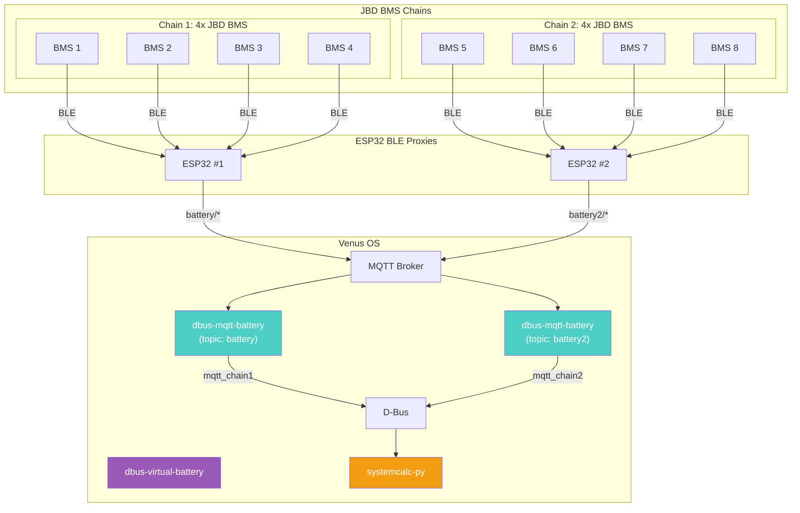
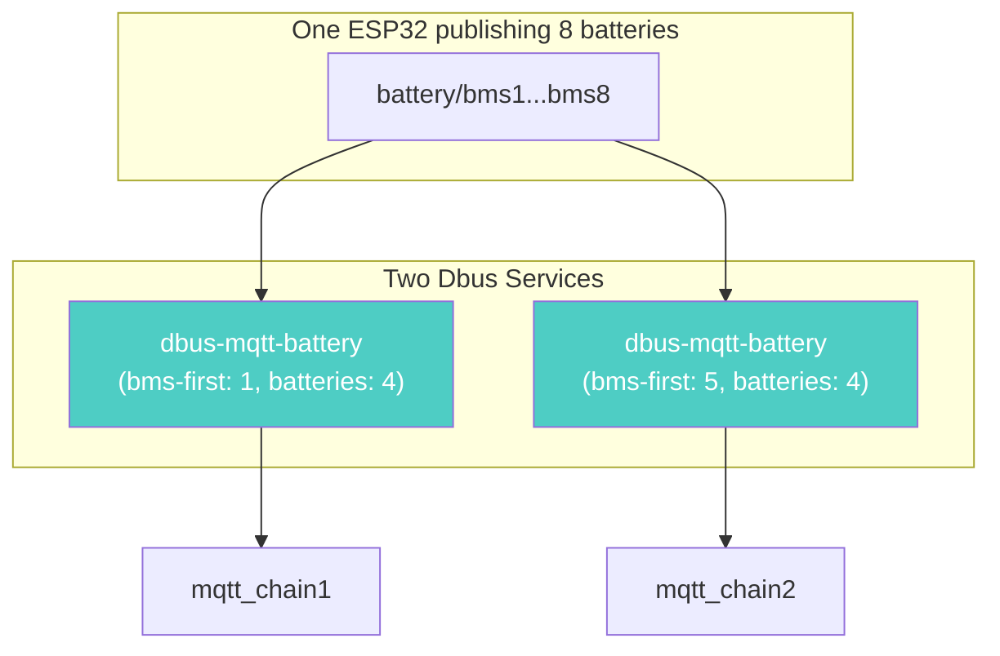

# System Architecture

## Data Flow



## Multi-Chain Configuration



## Runbook: Troubleshooting

### Package Not Showing in PackageManager

**Actions:**
```bash
# Verify version file
cat /data/dbus-mqtt-battery/version

# Verify setup script
ls -la /data/dbus-mqtt-battery/setup

# Restart PackageManager
svc -t /service/PackageManager
```

### Chain Shows N/A

**Actions:**
```bash
# Check ESP32 is publishing
mosquitto_sub -v -t 'battery/#' -C 5

# Check service is running
svstat /service/dbus-mqtt-chain1

# Verify D-Bus service
dbus -y com.victronenergy.battery.mqtt_chain1 /Dc/0/Voltage GetValue
```

---

## Related Documentation

- [inverter-control System Architecture](../inverter-control/.github/docs/system-architecture.md)
- [ADR-003: DVCC for JBD BMS Protection](../inverter-control/.github/docs/adr-001-grid-zero-architecture.md)
